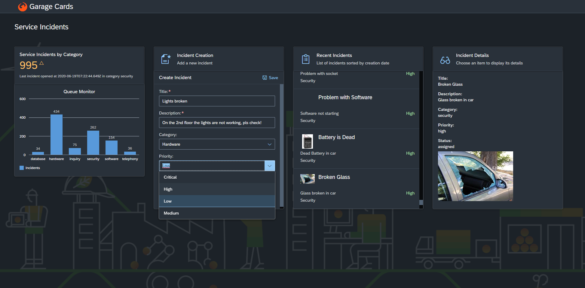

# Garage Cards

An example with several sap.ui.integration cards, a web socket connection to live reload the cards, and the UI5 event bus for communcation across cards.




## Prerequisites
The **UI5 build and development tooling command line interface (UI5 CLI)** has to be installed.
For installation instructions please see [Installing the UI5 CLI](https://github.com/SAP/ui5-tooling#installing-the-ui5-cli).

## Setup

1. Install all dependencies
    ```sh
    npm install
    ```

2. For development, start a local server and run the application. Updates to files will cause the app to reload automatically (http://localhost:8080/index.html)
    ```sh
    npm start
    ```
   
3. To run an optimized version that first builds a component preload and then serves from the dist folder run this command instead:
   ```sh
   npm run dist
    ```

## Testing
* Run ESLint code validation
    ```sh
    npm run lint
    ```

For more build and development options please see: [UI5 Build and Development Tooling](https://github.com/SAP/ui5-tooling)

## Support

This repository is based on the [OpenUI5 template demo apps](https://openui5.hana.ondemand.com/#/demoapps) and updated regularly with our latest recommendations. 
If you found a bug, please create an [OpenUI5 issue](https://github.com/sap/openui5/issues). Thank you!
